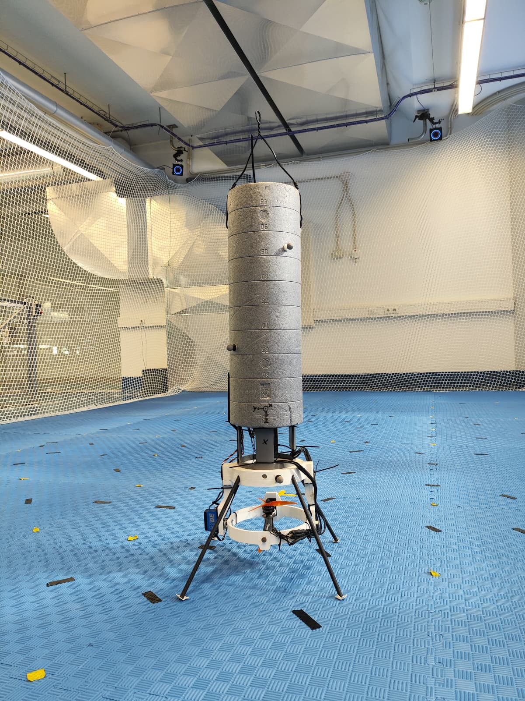
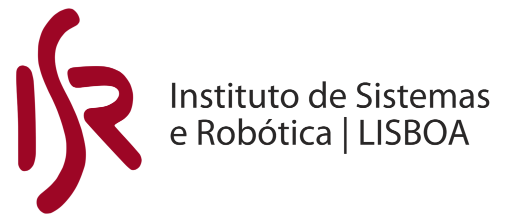

## The E-Rocket project

    

The E-Rocket is an experimental vehicle to serve as a low-cost and low-risk testbed for Guidance, Control & Navigation (GNC) algorithms for VTOL thrust vectoring vehicles. 

## Table of Contents

- [About](#about)
- [Getting Started](#getting-started)
- [Publications and Citation](#publications-and-citation)
- [Credits](#Credits)
- [Acknowledgements](#Acknowledgements)
- [License](#license)

  
## About

Developed at Instituto Superior Técnico (IST) from the University of Lisbon in the scope of Pedro Santos PhD thesis, under the supervision of Professor Paulo Oliveira. The first version of the prototype, including mechanical design, avionics hardware and software developement, and preliminary GNC algorithms, lead to the conclusion of two MSc thesis, by André Fonte and Pedro Martins.

## Getting Started

To do.

## Publications and Citation

### Master Thesis

- [Pedro Martins](https://github.com/PedromcaMartins) - A PX4-ROS 2 Avionics Architecture for the E-Rocket Thrust Vector Control and GNC Platform, 2025. Supervised by Prof. Paulo Oliveira and Pedro Santos.

- André Fonte - Integrated Nonlinear Control and Guidance System for an E-Rocket, 2025. Supervised by Prof Paulo Oliveira and Pedro Santos.

## Credits

Main developer team:

- [Pedro Santos](https://scholar.google.com/citations?user=HOhIHJAAAAAJ&hl=pt-PT)
- [Pedro Martins](https://github.com/PedromcaMartins)
- André Fonte
- [Paulo Oliveira](https://scholar.google.com/citations?hl=pt-PT&user=V97jzbwAAAAJ&view_op=list_works&sortby=pubdate)

The authors would like to acknowledge everyone at the DSOR lab of the Institute for Systems and Robotics (ISR -Lisboa) for their valuable insights and support throughout the development of this project. A special thank you goes to [Marcelo Jacinto](https://scholar.google.com/citations?user=tVPo_z0AAAAJ&hl=en) who shared with us all the knowledge he acquired while developing his own project [Pegasus Research](https://github.com/PegasusResearch).

## Acknowledgemnts

  
  
  
  

## License

To do.

<!--

**Here are some ideas to get you started:**

🙋‍♀️ A short introduction - what is your organization all about?
🌈 Contribution guidelines - how can the community get involved?
👩‍💻 Useful resources - where can the community find your docs? Is there anything else the community should know?
🍿 Fun facts - what does your team eat for breakfast?
🧙 Remember, you can do mighty things with the power of [Markdown](https://docs.github.com/github/writing-on-github/getting-started-with-writing-and-formatting-on-github/basic-writing-and-formatting-syntax)
-->
